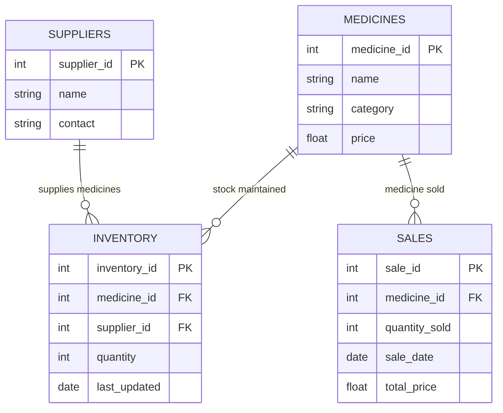

```mermaid
erDiagram

MEDICINES {
    int medicine_id PK
    string name
    string category
    float price
}

SUPPLIERS {
    int supplier_id PK
    string name
    string contact
}

INVENTORY {
    int inventory_id PK
    int medicine_id FK
    int supplier_id FK
    int quantity
    date last_updated
}

SALES {
    int sale_id PK
    int medicine_id FK
    int quantity_sold
    date sale_date
    float total_price
}

MEDICINES ||--o{ INVENTORY : "stock maintained"
SUPPLIERS ||--o{ INVENTORY : "supplies medicines"
MEDICINES ||--o{ SALES : "medicine sold"
```